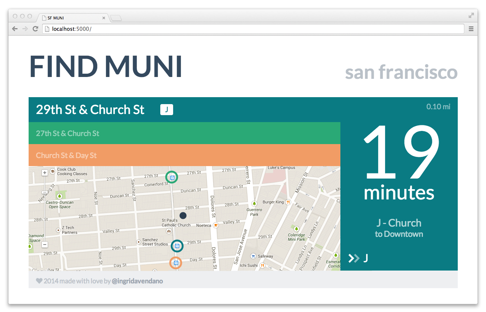
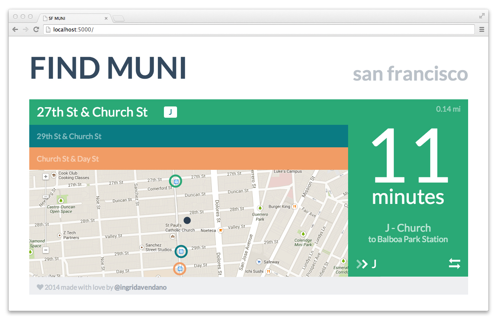
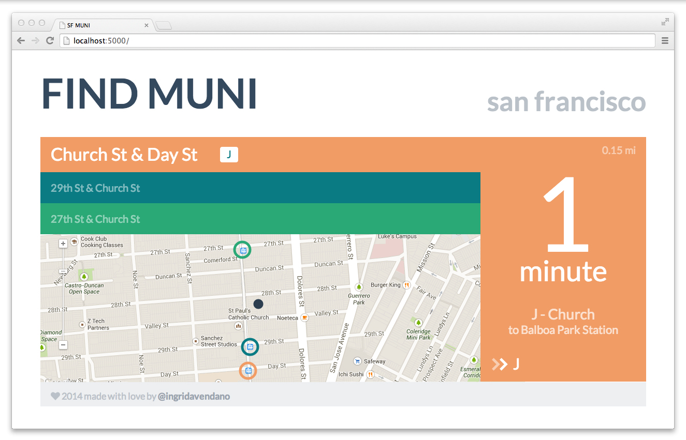

SF MUNI Departures App
======================

This is a web application that provides public transportation departures for MUNI and BART around San Francisco based on the geolocation of a user.

Development
-----------

The backend of this project used Python/Flask and MySQL. The 511 API provided XMLs of the departure times for each MUNI stop, however no geolocations were mapped to the stops. A database was created using the `seed.py` file to populate the latitude and longitude for each MUNI stop. 

XML data is read into the app through the deserialize.py file and mapped to the database for results. The nearby MUNI stops are determined using the Haversine formula to do geofencing. Found data about nearby stops are converted to JSON in the serialize.py file. The json module for Python did not provide enough functionality in the way needed to rearrange the data, so data was manually manipulated into JSON instead of using a JSONEncoder. Data was rearranged by priority by distance from user and nearest time.

For the frontend [Backbone](http://backbonejs.org/) framework was used to setup Models for each MUNI stop. While [Underscore](http://underscorejs.org/) was used to create the main template to navigate between different stops. 

Stylistic choices
-----------------

The departure time for a MUNI was in a large font at on the bottom of the route of the inbound or outbound MUNI has two arrows to indicate the direction on the left. On the right there is the option to see the reserve direction (if there is one) for the specific route being viewed. 

At the top of the name of the address of the MUNI stop is also the list of routes that are currently being served at that location. If there are no upcoming departure times for a specific route then it will not display. 

Up to three different MUNI stops will display given the location of the user. This was a design choice strictly to simplify the amount of time spent on creating this app. 

The map view is also disabled and won't allow a user to move their geolocation marker. Users have the option to just click between the 1-3 stops provided. 

Things to improve
-----------------

* Make app work for mobile.
* Provide a notification to the user that their geolocation is needed. 
* Provide alternative options to users when MUNI stops are not available or a user lives too far away.
* Refactor how JSON was encoded from the database to frontend.
* Allow a user to move the map and drag the pin marker to a new location to find alternative MUNI times. 
* Provide more departure times (when available) for routes.
* ~~Provide loading screen.~~

Extras
------

Data for this app is provided from:
* [511 Real Time Transit Departure API](http://511.org/developer-resources_transit-api.asp)
* [MUNI Transit Data](http://www.sfmta.com/about-sfmta/reports/gtfs-transit-data)

A design aesthetic was inspired by:
* [Flat UI](http://designmodo.github.io/Flat-UI/)
